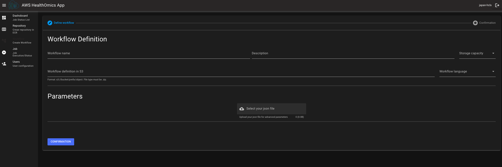

# Amazon Omics Webapp

This webapp allows users such as admin and bioinformaticians to operate Amazon Omics workflow easily. Admin can create new users and add them a group to access this webapp. Users like bioinformaticians can create new repository in Amazon ECR, create new workflow and run the workflow in Amazon Omics. This webapp visualizes the run command status with the chart and tables.

## Architecture overview


You can create new workflow, execute a run command and visualize the job status related to Amazon Omics in the webapp. The webapp contains the features in the following pages. As default, the `admin` and `bioinformaticia` groups are created by this app.

### Dashboard


You can see the run command status, run command details and run tasks timeline.

### Repository


You can create new repository in Amazon ECR.

### Workflow


You can create new workflow in Amazon Omics

### Job


You can exectue new run command in Amazon Omics. In addition, you can see the Amazon Omics workflow list and run command list in this page.

### Users (Only Admin)


Only admin can access to this page and add new user or add a user to a group in Amazon Cognito. Also, admin can delete a user if needed in this page.

## Prerequisites

- An AWS accoount
- Create the buckets for Omics
  - Need to create the input and output bucket for Amazon Omics before deploying the webapp. Put the workflow definition file and datasets for running workflow in the input bucket. The output files from your run command are stored in the output bucket.
- Create reference and sequence stores in Amazon Omics depending on your workflow and definition
  - If you want to use the webapp quickly, recommend to prepare [the Amazon Omics - End to End environment](https://github.com/aws-samples/amazon-omics-end-to-end-genomics) before deploying the webapp.
- Deploy Region
  - The frontend stack like AWS WAF, Amazon CloudFront and S3 is deployed on `us-east-1` and other services are deployed in your selected region. However, be careful of the supported region in Amazon Omics. See [this document](https://docs.aws.amazon.com/general/latest/gr/omics-quotas.html) if you get more information.

> ## Note
>
> Cross region imports are not supported in Amazon Omics at this moment. If you want to use the sample data in [the Amazon Omics - End to End environment](https://github.com/aws-samples/amazon-omics-end-to-end-genomics) for the webapp and deploy the webapp in another supported region outside of us-east-1, copy the example data to your input bucket in that region.

## Configuration for the webapp

Add your context parameters to `cdk.json` as follows, then run `npm run <cmd> -- --profile <your profile>`.

```json
"context": {
    "stage": "dev",
    "dev": {
      "appName": "omics-app-dev", // Application name
      "alias": "japan-hcls", // Your alias
      "appAdminEmail": "<Your admin email address>", // Admin email address for Cognito
      "allowedIps": ["<Allowed CIDR>"], // Allowed CIDR list to access CloudFront with WAF
      "omicsBuckets": {
        "input": "<Your input bucket name>",  // Your input bucket for Omics
        "output": "<Your output bucket name>" // Your output bucket for Omics
      }
    },
    "prod": {
      "appName": "omics-app-prod",
      "alias": "admin",
      "appAdminEmail": "<Your admin email address>",
      "allowedIps": ["<Allowed CIDR>"],
      "omicsBuckets": {
        "input": "<Your input bucket name>",
        "output": "<Your output bucket name>"
      }
    }
  }

```

## Deployment

You can deploy the webpapp with only following three commands.

```bash
# 1. Deploy the infrastructure stack with AWS CDK
npm run deployInfra -- --profile <your profile>

# 2. SPA building with Quasar
npm run buildWeb

# 3. Deploy the frontend stack with AWS CDK
npm run deployFrontend -- --profile <your profile>

```

> ### Notice
>
> Execute the `bootstarp` command as follows if you have never executed bootstrap command with CDK in your region.
>
> ```
> npm run cdk bootstrap -- --profile <your profile>
> ```

## Cleanup

```bash
# 1. Destroy the frontend stack
npm run destroyFrontend -- --profile <your profile>

# 2. Destroy the infrastructure stack with AWS CDK
npm run destroyInfra -- --profile <your profile>

```

Also, delete your repositories in ECR if you need.

## Commands

- `npm run deployInfra -- --profile <your profile>`
  - Deploy the infrastructure stack with AWS CDK
- `npm run buildWeb`
  - SPA building with Quasar
- `npm run deployFrontend -- --profile <your profile>`

  - Deploy the frontend stack with AWS CDK

- `npm run destroyInfra -- --profile <your profile>`
  - Destroy the infrastructure stack with AWS CDK
- `npm run destroyFrontend -- --profile <your profile>`
  - Destroy the frontend stack with AWS CDK

## Security

See [CONTRIBUTING](CONTRIBUTING.md#security-issue-notifications) for more
information.

## License

This code is licensed under the MIT-0 License. See the LICENSE file.
