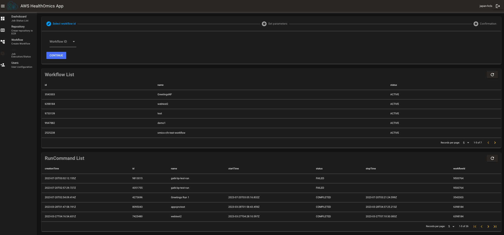
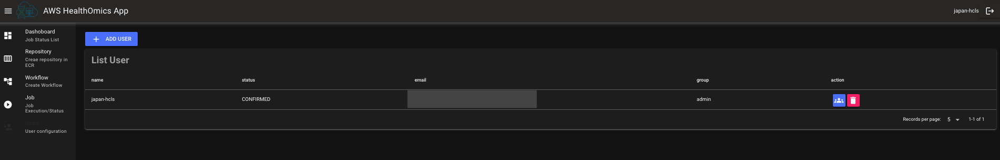

# AWS HealthOmics Webapp

This webapp allows users such as admin and bioinformaticians to operate AWS HealthOmics workflow easily. Admin can create new users and add them a group to access this webapp. Users like bioinformaticians can create new repository in Amazon ECR, create new workflow and run the workflow in AWS HealthOmics. This webapp visualizes the run command status with the chart and tables.

## Architecture overview


You can create new workflow, execute a run command and visualize the job status related to AWS HealthOmics in the webapp. The webapp contains the features in the following pages. As default, the `admin` and `bioinformatician` groups are created by this app.

### Dashboard


You can see the run command status, run command details and run tasks timeline.

### Repository


You can create new repository in Amazon ECR.

### Workflow

#### Private workflow


You can create new private workflow in AWS HealthOmics

#### Ready2Run workflow


You can see the list of Ready2Run workflows, and run the selected workflow.

### Job


You can exectue new run command in AWS HealthOmics. In addition, you can see the AWS HealthOmics workflow list and run command list in this page.

### Users (Only Admin)



Only admin can access to this page and add new user or add a user to a group in Amazon Cognito. Also, admin can delete a user if needed in this page.

## Prerequisites

- An AWS accoount
- Create the buckets for Omics
  - Need to create the input and output bucket for AWS HealthOmics before deploying the webapp. Put the workflow definition file and datasets for running workflow in the input bucket. The output files from your run command are stored in the output bucket.
- Create reference and sequence stores in AWS HealthOmics depending on your workflow and definition
  - If you want to use the webapp quickly, recommend to prepare [the AWS HealthOmics - End to End environment](https://github.com/aws-samples/amazon-omics-end-to-end-genomics) before deploying the webapp.
- Deploy Region
  - The frontend stack like AWS WAF, Amazon CloudFront and S3 is deployed on `us-east-1` and other services are deployed in your selected region. However, be careful of the supported region in AWS HealthOmics. See [this document](https://docs.aws.amazon.com/general/latest/gr/omics-quotas.html) if you get more information.

> ## Note
>
> Cross region imports are not supported in AWS HealthOmics at this moment. If you want to use the sample data in [the AWS HealthOmics - End to End environment](https://github.com/aws-samples/amazon-omics-end-to-end-genomics) for the webapp and deploy the webapp in another supported region outside of us-east-1, copy the example data to your input bucket in that region.

## Configuration for the webapp

Add your context parameters to `cdk.json` as follows, then run `npm run <cmd>`.

```json
"profile": "<Your AWS profile>"  // Utilize the profile to deploy the stack by CDK
"context": {
    "base": {
      "deployAwsEnv": {},
      "awsProfile": "<Your AWS profile>" // Utilize the profile to get and put some parameters for SSM Parametor Store
    },
    "stage": "dev",
    "dev": {
      "appName": "omics-app-dev", // Application name
      "alias": "japan-hcls", // Your alias
      "appAdminEmail": "<Your admin email address>", // Admin email address for Cognito
      "allowedIps": ["<Allowed CIDR>"], // Allowed CIDR list to access CloudFront with WAF
      "omicsBuckets": {
        "input": "<Your input bucket name>",  // Your input bucket for Omics
        "output": "<Your output bucket name>" // Your output bucket for Omics
      }
    },
    "prod": {
      "appName": "omics-app-prod",
      "alias": "admin",
      "appAdminEmail": "<Your admin email address>",
      "allowedIps": ["<Allowed CIDR>"],
      "omicsBuckets": {
        "input": "<Your input bucket name>",
        "output": "<Your output bucket name>"
      }
    }
  }

```

## Deployment

1. Install the dependencies

```zsh
npm ci
```

2. Deploy AWS resources

```zsh
# Deploy the infrastructure and frontend stacks with AWS CDK
npm run deployAll
```

You can see the web app url like this after completing frontend stack deployment. You can sign in the app with your email and temporary password which you receive in your email.

```zsh

Outputs:
xxx-dev-omics-app-frontendStack.cloudfrontdomain = xxxx.net
```

> ### Notice
>
> Execute the `bootstarp` command as follows if you have never executed bootstrap command with CDK in your region.
>
> ```
> npm run cdk bootstrap
> ```

## Cleanup

```bash
# Destroy all stacks(the infrastructure and frontend stack) with AWS CDK
npm run destroyAll
```

> ### Notice
>
> The following destroy failures may occur because the files in your bucket cannot be emptied. If it occurred, please empty them from AWS Management Console and rerun the command
>
> ```
> XXX was not successfully deleted: The following resource(s) failed to delete: [XXomicsappfrontendStackwebappspaCloudFrontLoggingB
> ucketXX].
> ```

Also, delete your repositories in ECR if you need.

## Commands

- `npm run deployInfra`

  - Deploy the infrastructure stack with AWS CDK

- `npm run deployFrontend`

  - Deploy the frontend stack with AWS CDK

- `npm run deployAll`
  - Deploy the infrastructure and frontend stacks with AWS CDK
- `npm run destroyInfra`
  - Destroy the infrastructure stack with AWS CDK
- `npm run destroyFrontend`
  - Destroy the frontend stack with AWS CDK
- `npm run destroyAll`
  - Destroy all stacks(the infrastructure and frontend stack) with AWS CDK

## Security

See [CONTRIBUTING](CONTRIBUTING.md#security-issue-notifications) for more
information.

## License

This code is licensed under the MIT-0 License. See the LICENSE file.
